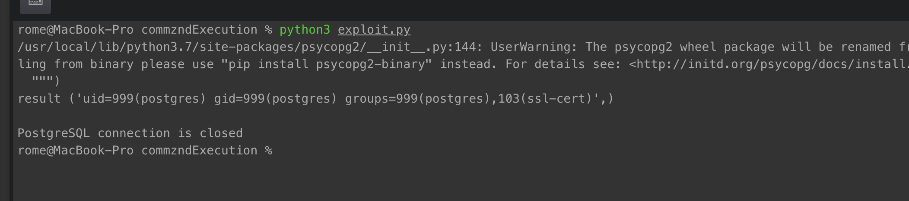

# Execude Code vulnerability

**CWE-ID**: Execude Code (78)  
**Exploit source**: [Adapted to python EDB:46813](https://www.exploit-db.com/exploits/46813)  
**CVE-ID**: 2019-9193  
**CVSS score (version 2)**: 9.0  

## Description
In PostgreSQL 9.3 through 11.2, the "COPY TO/FROM PROGRAM" function allows superusers and users in the 'pg_execute_server_program' group to execute arbitrary code in the context of the database's operating system user. This functionality is enabled by default and can be abused to run arbitrary operating system commands on Windows, Linux, and macOS.


## Exploit description

Insert SQL query to postgres for executing system command

----------

## Requirements
* python3
* docker-compose


## Setup

Start the environment:

```
./install.sh
```

## Exploit
 1. Run `python3 exploit.py` and get result for command `id`
 

NOTE:  
Actually, we can exec any command, but postgres will return only first row of result


## Result

We can execute any system command in the system where postgres running
