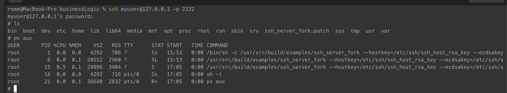
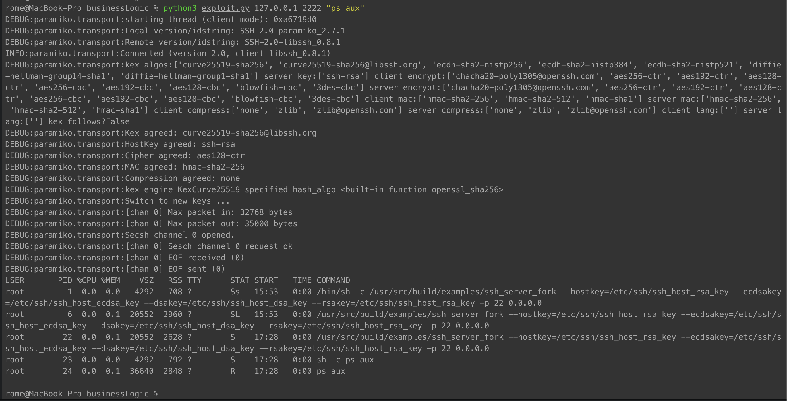

# Improper Authentication vulnerability

**CWE-ID**: Improper Authentication (287)
**Exploit source**: [EDB:46307](https://www.exploit-db.com/exploits/46307)
**CVE-ID**: CVE-2018-10933  
**CVSS score**: 6.4


libssh is a multiplatform C library implementing the SSHv2 protocol on client and server side. A logic vulnerability was found in libssh's server-side state machine. The attacker can send the `MSG_USERAUTH_SUCCESS` message before the authentication succeed. That can bypass the authentication and access the target SSH server.

----------

## Requirements
* python3
* docker-compose


## Setup

Start the environment:

```
./install.sh
```

After the environment is started, we can connect the `your-ip:2222` port (account password: `myuser:mypassword`), which is a legal ssh login:



## Exploit

We can use t script from [exploit.py](exploit.py) to proof the vulnerability.
For example, for running comman ```ps aux``` as from previous picture, we need to run: ```python3 exploit.py 127.0.0.1 2222 "ps aux"```  
Result:

