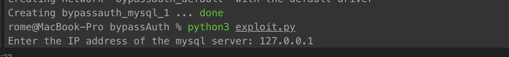
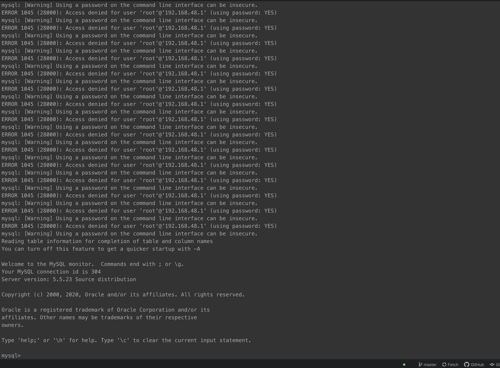

# Improper Authentication vulnerability

**CWE-ID**:   Improper Authentication (287)
**Exploit source**: [EDB: 19092](https://www.exploit-db.com/exploits/19092)
**CVE-ID**:  CVE-2012-2122
**CVSS score (version 2)**: 5.1

## Description
sql/password.c in Oracle MySQL 5.1.x before 5.1.63, 5.5.x before 5.5.24, and 5.6.x before 5.6.6, and MariaDB 5.1.x before 5.1.62, 5.2.x before 5.2.12, 5.3.x before 5.3.6, and 5.5.x before 5.5.23, when running in certain environments with certain implementations of the memcmp function, allows remote attackers to bypass authentication by repeatedly authenticating with the same incorrect password, which eventually causes a token comparison to succeed due to an improperly-checked return value.

## Exploit description
Without knowing the correct password in our environment, run the following command under bash, after a certain number of attempts, you can successfully log in:


----------

## Requirements
* mysql
* python3
* docker-compose


## Setup

Start the environment:

```
./install.sh
```

## Exploit

We can use t script from [exploit.py](exploit.py) to proof the vulnerability.
Need to run: ```python3 exploit.py ``` and after enter ip of mysql app (127.0.0.1) get following result:




## Result

We logged in to MySQL console without password
