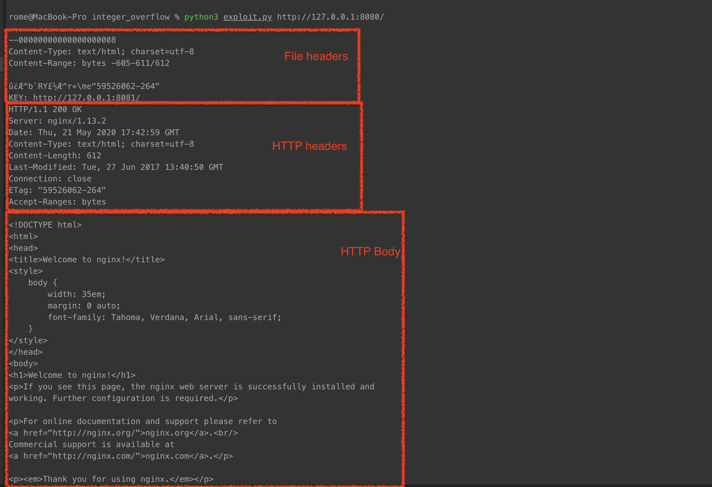

# Integer overflow vulnerability

**CWE-ID**:  Integer Overflow or Wraparound (190)  
**Exploit source**: [Simplified code from github issue](https://github.com/nixawk/labs/issues/15)
**CVE-ID**: CVE-2017-7529
**CVSS score (version 2)**: 5.0  

##Description
Nginx versions since 0.5.6 up to and including 1.13.2 are vulnerable to integer overflow vulnerability in nginx range filter module resulting into leak of potentially sensitive information triggered by specially crafted request.

## Exploit description
If the Range header is included in my request, Nginx will return the content of the specified length based on the start and end positions I specified. And if I construct two negative positions, such as (-600, -9223372036854774591), it will be possible to read the data in the negative position. If this request hits the cache file again, you may be able to read the "file header" and "HTTP return packet header" before the "HTTP return packet body" in the cache file.


----------

## Requirements
* python3
* docker-compose


## Setup

Start the environment:

```
./install.sh
```

## Exploit

We can use t script from [exploit.py](exploit.py) to proof the vulnerability.
Need to run: ```python3 exploit.py http://127.0.0.1:8080/``` and get following result:



## Result

It can be seen that the "file header", "HTTP return packet header" and the like located before the "HTTP return packet body" are read across the border.
