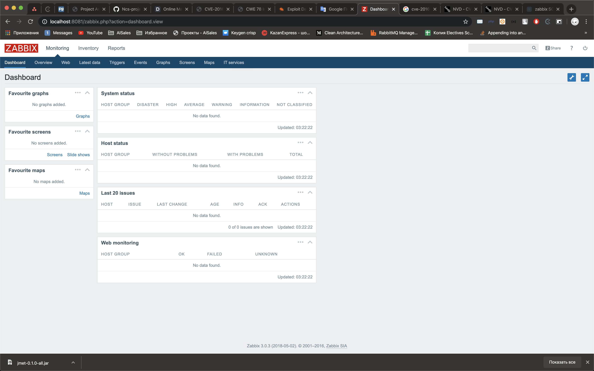
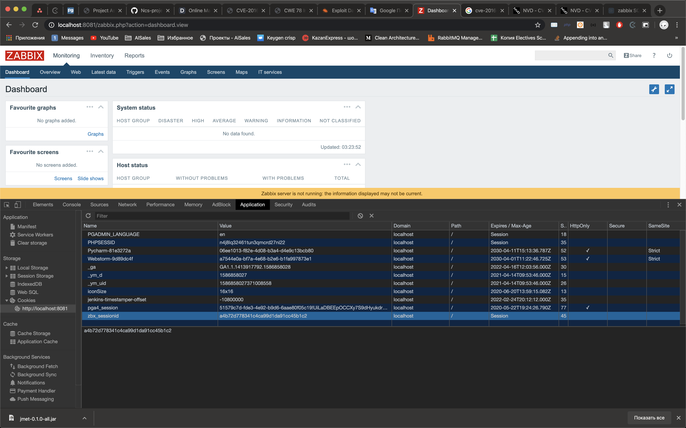
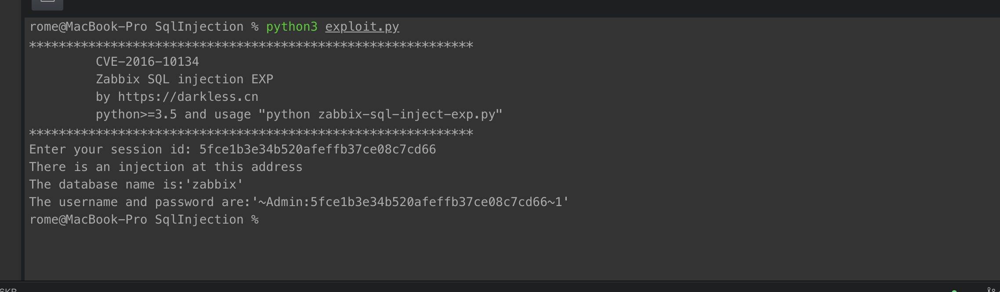
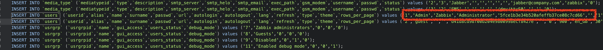

# SQL Injection vulnerability

**CWE-ID**:   Execute CodeSql Injection (89)
**Exploit source**: [Translated article](https://darkless.cn/2019/08/03/zabbix-sql-injection/)
**CVE-ID**:  CVE-2016-10134
**CVSS score (version 2)**: 7.5

## Description
SQL injection vulnerability in Zabbix before 2.2.14 and 3.0 before 3.0.4 allows remote attackers to execute arbitrary SQL commands via the toggle_ids array parameter in latest.php.


----------

## Requirements
* python3
* docker-compose


## Setup

Start the environment:

```
./install.sh
```

## Exploit
 1. After env is built, you need to open [http://127.0.0.1:8081](http://127.0.0.1:8081) and login as guest (login: guest, empty password)
    
 2. Open site coockies and save value of `zbx_sessionid`
    
 3. Run `python3 exploit.py` and enter session_id which you saved
 4. Get Administrator's login and password
    
 5. We can check it from database records:
    


## Result

Admin's login and passwords retrived usin sql injection
